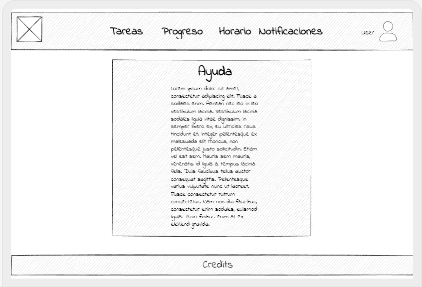

<!-- Proyecto en desarrollo, las funcionalidades pueden sufrir modificaciones en las distintas versiones -->

    Autores: Jorge Botarro Westerhout
             Jorge Ugarte Olivares

# SimplyTask!

**SimplyTask!** es un planificador de tareas, cuyo objetivo es ayudar al usuario a desarrollar su día de manera organizada, sin olvidar actividades claves o fechas importantes, mediante el uso de notificaciones y recordatorios programados para que el usuario alcance sus metas en un plazo determinado.

## **Funcionalidades**

* **Registro.** El sistema permite el registro de nuevos usuarios, solicitando el nombre de usuario, email, contraseña y la validación de la misma, además de aceptar los TyC de la aplicación.

* **Login.** Solicita al usuario identificarse con su respectivo nombre de usuario y contraseña, permitiendo acceder a su cuenta y sus registros.

* **Agregar Item.** Permite la adición de nuevas tareas asociadas a la cuenta. Requiere un nombre de item, fecha de inicio y término (DD/MM/YYYY) sumado a una descripción, opcionalmente se puede solicitar notificación de un dia antes y marcar el item como importante.

* **Ver calendario.** Accede al calendario generado para la cuenta logeada. Muestra los recordatorios agregados hasta el momento según filtro establecido.

* **Tareas.** Dirige al usuario a la lista de tareas pendientes.

* **Progreso.** Muestra estadisticas de las tareas realizadas y las aún pendientes. <!-- in progress-->

* **Horario.** Muestra un calendario de la semana con las respectivas tareas ingresadas.

* **Notificaciones.** centro de notiicaciones y avisos para el usuario. <!-- in progress-->

* **User.** Desplega un menú conformado por perfil, ajustes, ayuda y cerra sesión. <!-- in progress-->

* **Perfil.** Permite revisar todo lo referente al perfil en cuanto a foto, intereses y bio se refiere. <!-- in progress-->

* **Ajustes.** Apartado de ajustes de sesión y configuración de la aplicación. <!-- in progress-->

* **Cerrar Sesión.** Permite cerrar sesión y retorna al index. <!-- in progress-->

## **Wireframes y Mockups**

    

 

    

 

    

 

    

 

    

 

    

 

    

 

    

 

<a class="url" href="https://app.uizard.io/p/80e8dc77"> Link wireframes Interactivo</a>
 
### **Formulario de registro e inicio de sesión**

    

 

    

