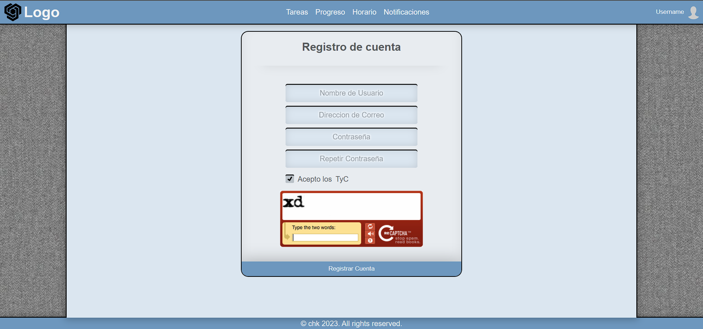

<!-- Proyecto en desarrollo, las funcionalidades pueden sufrir modificaciones en las distintas versiones -->

    Autores: Jorge Botarro Westerhout
             Jorge Ugarte Olivares

# SimplyTask

**SimplyTask** es un planificador de tareas, cuyo objetivo es ayudar al usuario a desarrollar su día de manera organizada, sin olvidar actividades claves o fechas importantes, mediante el uso de notificaciones y recordatorios programados para que el usuario alcance sus metas en un plazo determinado.

## (E.P.1.1) Funcionalidades

* **Registro de usuarios.** El sistema permite el registro de nuevos usuarios, solicitando el nombre de usuario, email, contraseña y la validación de la misma, además de aceptar los TyC de la aplicación.

* **Login.** Solicita al usuario identificarse con su respectivo nombre de usuario y contraseña, permitiendo acceder a su cuenta y sus registros.

* **Agregar Item.** Permite la adición de nuevas tareas asociadas a la cuenta. Requiere un nombre de item, fecha de inicio y término (DD/MM/YYYY) sumado a una descripción, opcionalmente se puede solicitar notificación de un dia antes y marcar el item como importante.

* **Ver calendario.** Accede al calendario generado para la cuenta logeada. Muestra los recordatorios agregados hasta el momento según filtro establecido.

## (E.P.1.2) Mockups

<!-->En proceso...<-->

## (E.P.1.3)

<!-->En proceso...<-->

## (E.P.1.4) Formulario de registro e inicio de sesión

    

 

    

